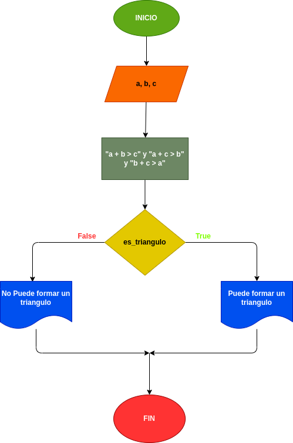

# Quiz instrucciones condicionales

### Realice el análisis, diseño y construcción para resolver el siguiente problema:

Dados tres números a, b y c, correspondientes a la longitud de los lados de una figura geométrica, determinar si pueden formar los lados de un triángulo.

---

# Analisis

Variables de entrada (imput)

- a : es la longitud "a" del triangulo

- b : es la longitud "b" del triangulo

- c : es la longitud "c" del triangulo

Variables de proceso y salida (processig,storage, output)

- es_triangulo : se usara para medir las distintas longitudes del triangulo 

# DISEÑO

### Diagrama de flujo
